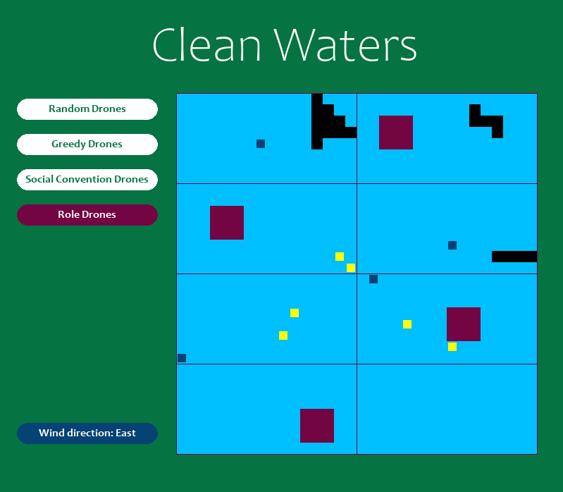

# AASMA’22

## Group 30

Bernardo Quinteiro [93692](bernardo.quinteiro@tecnico.ulisboa.pt) | 
Guilherme Saraiva [93717](guilherme.a.saraiva@tecnico.ulisboa.pt) | 
Sara Ferreira [93756](sara.c.ferreira@tecnico.ulisboa.pt)

## Welcome to Clean Waters!

In this project, we implemented a group of intelligent drones of
two different types whose goal is to detect and clean up oil spills in
the ocean. One type of drone focuses on scanning the environment,
while the other cleans the polluted tiles suggested by the scanner
drones as well as scanning its adjacent tiles. The main problem lay
in cleaning the polluted tiles as efficiently and as quickly as possible
using a multi-agent system while dealing with the spread of said
pollution. We solved the problem by using different kinds of reactive
architectures, with which we came to a conclusion regarding which
one suited this problem best.



### Installation

Firstly you need to install the required modules. To do that just run:
```shell
pip install -r requirements.txt
```

Then, there are 2 ways to run the project. The first one is to manually execute the file 
**_CleanWaters.exe_** that can be found in the _CleanWaters/_ folder.

The second one is by running:
```shell
python src/main.py
```

If you want to get the comparison between the different drones, just run:
```shell
python src/main.py --episodes N
```
In which the letter N corresponds to the number of episodes that you want to run for each metric.

<video src="assets/CleanWatersDemo.mp4"></video>